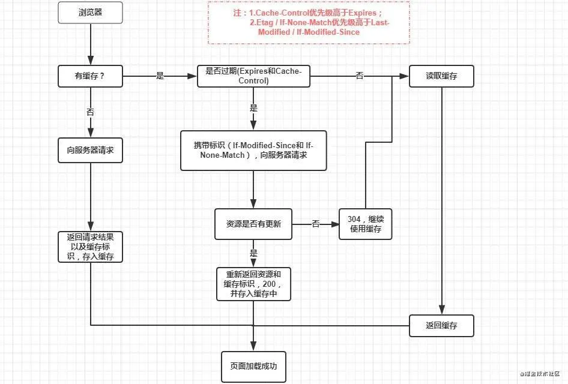

### 浏览器缓存
- [参考](https://mp.weixin.qq.com/s/CsJyKVq3IIjDv32TZ9m7fQ)

### 什么是缓存？
* 当我们第一次访问网站 例如juejin.cn 时，电脑会把网站上的资源 如图片和数据下载到电脑上，  
  当我们再次访问该网站时，网站就会从电脑中加载出来，这就是缓存。

### 缓存的好处
- 缓解服务器压力 不用每次都去请求服务器
- 性能提升，加载本地资源要比请求服务器快
- 减少带宽消耗 加载本地资源消耗的带宽比较小

### web缓存类型
- 数据库缓存
- CDN缓存
- 代理服务器缓存
- 浏览器缓存 是指本地计算机开辟一个内存区，同时也开辟一个硬盘区作为数据传输的缓冲区，然后用这个缓冲区暂时保存  
  用户以前访问过的信息

### 浏览器缓存过程
- 强缓存
- 协商缓存

### 缓存位置
- Service Worker
- Memory Cache
- Disk Cache
- Push Cache

### 强缓存
- 当我们访问URL时 不会向服务器发送请求，直接从缓存中读取资源，但是会返回200状态码

#### 如何设置强缓存 
- 浏览器会根据response Header 来判断是否对资源进行缓存，如果响应头中存在 expires pragma 或者cache-control 字段  
  代表是强缓存，浏览器就会把资源存在memory cache 或 disk cache 中。第二次请求时，浏览器判断请求头参数，  
  如果符合强缓存条件，就从本地缓存中拿数据。

  

- expires  
  是http1.0控制网页缓存的字段，值为时间戳（格林尼治时间），服务器返回该请求结果缓存的到期时间  
  再次发送请求时，如果未超过过期时间，则直接使用缓存资源，过期了则重新请求。  
  缺点：判断是否过期使用本地时间，但本地时间是可以修改的

- cache-control  
  是http1.1中控制网页缓存的字段，优先级更高。  
  主要取值：  
  1. public 客户端和服务器都可以缓存资源  
  2. privite 资源只有客户端缓存  
  3. no-cache 客户端缓存资源，但是 是否缓存需要经过协商缓存来验证  
  4. no-store 不使用缓存  
  5. max-age 缓存保质期  
  使用了 max-age 相对时间 解决了 expires 的问题  